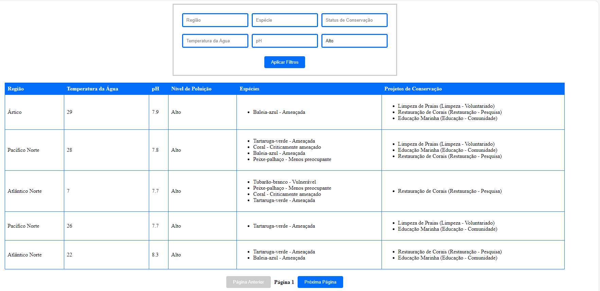
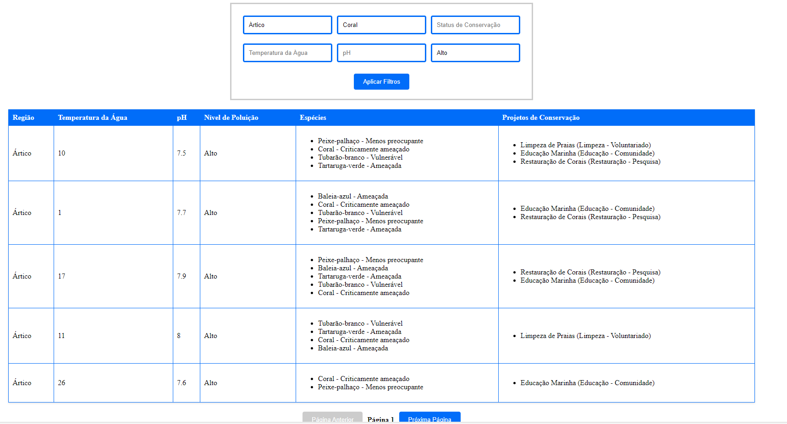
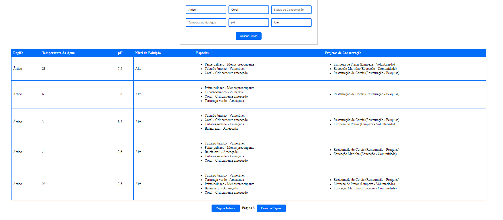

# Instruções para Execução da Aplicação

A aplicação "Oceans 20" é uma ferramenta web que permite aos usuários explorar dados sobre a saúde dos oceanos e contribuir com ideias para a conservação marinha. Aqui estão as instruções para executar a aplicação:

## Pré-requisitos
1. Certifique-se de ter o Node.js e o Angular CLI instalados em seu sistema. Se não, você pode baixá-los a partir dos seguintes links:
    - Node.js: https://nodejs.org/
    - Angular CLI: https://cli.angular.io/

## Passos para Execução
1. **Clone o repositório**: Clone o repositório do projeto para o seu sistema local usando o comando `git clone`.
2. **Instale as dependências**: Navegue até a pasta do projeto e execute o comando `npm install` para instalar todas as dependências necessárias.
3. **Execute a aplicação**: Execute o comando `ng serve` para iniciar o servidor de desenvolvimento. Navegue até `http://localhost:4200/`. A aplicação será recarregada automaticamente se você alterar qualquer um dos arquivos de origem.

## Funcionalidades da Aplicação
A aplicação fornece vários filtros para ajudar os usuários a explorar os dados dos oceanos:

- **Filtro por Região**: Permite aos usuários filtrar dados oceânicos por regiões geográficas específicas.
- **Filtro por Espécie**: Habilita a filtragem dos dados baseados em espécies ameaçadas listadas.
- **Filtro por Status de Conservação**: Possibilita que os usuários filtrem espécies baseando-se em seu status de conservação (e.g., vulnerável, em perigo).
- **Filtro por Temperatura da Água**: Disponibiliza uma funcionalidade de filtro para visualizar as regiões oceânicas com base na temperatura da água.
- **Filtro por pH**: Implementa um filtro para analisar as condições oceânicas de acordo com o pH da água.
- **Filtro por Níveis de Poluição**: Oferece um filtro para selecionar dados baseados nos níveis de poluição, como plástico ou químicos.

